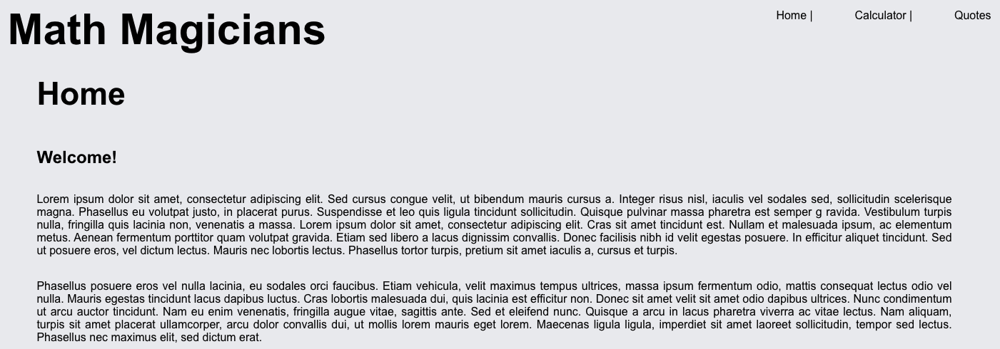
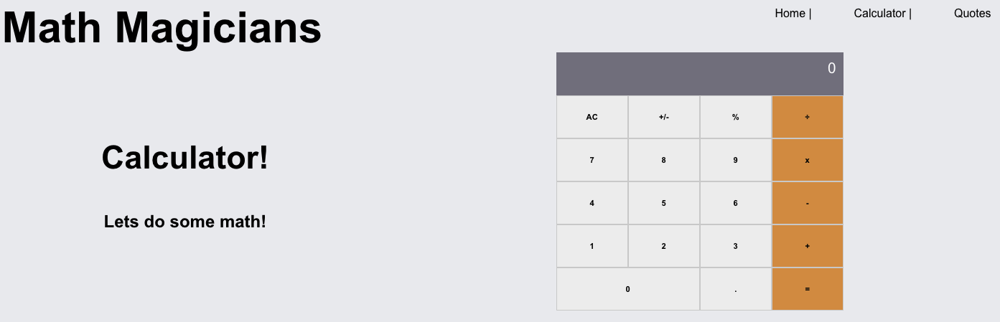
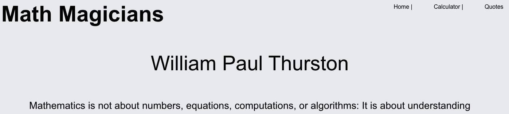

# Math Magicians

# Live Version

CHECK IT IN HEROKU: [Math-Magicians](https://react-math-magicians.herokuapp.com/)

CHECK IT IN NETLIFY: [Math-Magicians](https://serene-mayer-05afd9.netlify.app/)

## Built With

- HTML&CSS
- Javascript
- React

## Getting Started
To get a local copy up and running follow these simple steps.

### Setup

### Install
- Open your console and change the current working directory into the destination for this project.
- Type `git clone git@github.com:JasemDuncan/math-magicians.git`
- Type Enter to finish the installation process.
## Authors

👤 **Jasem Duncan Valencia**

- GitHub: [@JasemDuncan](https://github.com/JasemDuncan)
- Twitter: [@JasemDuncan](https://twitter.com/JasemDuncan)
- LinkedIn: [@JasemDuncan](https://www.linkedin.com/in/jasem-duncan-valencia/)
## 🤝 Contributing

Contributions, issues, and feature requests are welcome!

Feel
## Show your support

Give a ⭐️ if you like this project!
## Acknowledgments

- Microverse for the guidelines used for this project
- My SO and project manager, Mane
## 📝 License

This project is [MIT](./LICENSE.md) licensed.
